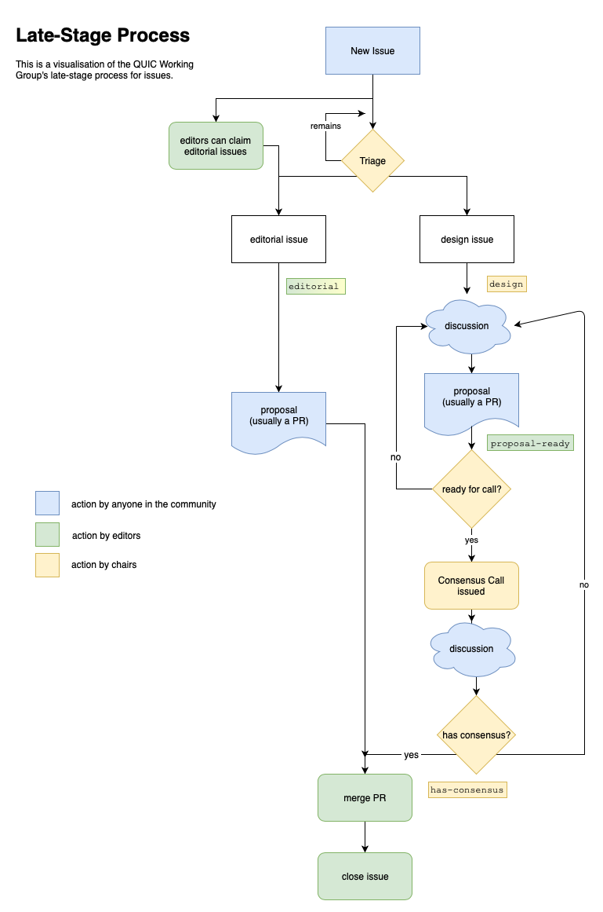

# Contributing to QUIC

Anyone can contribute to QUIC; you don't have to join the Working Group, because there is no "membership" -- anyone who participates in the work, as outlined below, is part of the QUIC Working Group.

Before doing so, it's a good idea to familiarize yourself with our current [issues list](https://github.com/quicwg/base-drafts/issues) and [charter](https://datatracker.ietf.org/wg/quic/about/). If you're
new to this, you may also want to read the [Tao of the IETF](https://www.ietf.org/tao.html).

**Be aware that all contributions fall under the "NOTE WELL" terms outlined below.**

<!-- START doctoc generated TOC please keep comment here to allow auto update -->
<!-- DON'T EDIT THIS SECTION, INSTEAD RE-RUN doctoc TO UPDATE -->

- [Following Discussion](#following-discussion)
- [Raising Issues](#raising-issues)
- [Resolving Issues](#resolving-issues)
- [Pull Requests](#pull-requests)
- [Code of Conduct](#code-of-conduct)
- [NOTE WELL](#note-well)

<!-- END doctoc generated TOC please keep comment here to allow auto update -->

## Following Discussion

The Working Group has a few venues for discussion:

* We plan to meet at all [IETF meetings](https://www.ietf.org/meeting/) for the foreseeable future, and hold interim meetings between them. See our [meeting materials repository](https://github.com/quicwg/wg-materials) and the [official proceedings](https://datatracker.ietf.org/wg/quic/meetings/).

* Our [mailing list](https://www.ietf.org/mailman/listinfo/quic) is used for most communication, including notifications of meetings, new drafts, consensus calls and other business, as well as issue discussion.

* We also discuss specific issues on the appropriate issues list in [Github](https://github.com/quicwg/). If you don't want to use Github to follow these discussions, you can subscribe to the [issue announce list](https://www.ietf.org/mailman/listinfo/quic-issues).

To be active in the Working Group, you can participate in any of these places. Most activity takes
place on the mailing list, but if you just want to comment on and raise issues, that's fine too.

## Raising Issues

We use our [Github](https://github.com/quicwg/) issues lists to track items for discussion and
their resolution.

Before filing a new issue, please consider a few things:

* Issues should be just that; issues with our deliverables, **not proposals, questions or support requests**.
* Please review the issues list to make sure that you aren't filing a duplicate.
* If you're not sure how to phrase your issue, please ask on the [mailing list](https://www.ietf.org/mailman/listinfo/quic).

Issues can also be raised on the [Working Group mailing
list](https://www.ietf.org/mailman/listinfo/quic) by clearly marking them as such (e.g., "New
Issue" in the `Subject:` line).

Be aware that issues might be rephrased, changed in scope, or combined with others, so that the
group can focus its efforts. If you feel that such a change loses an important part of your
original issue, please bring it up, either in comments or on the list.

Off-topic and duplicate issues will be closed without discussion. Note that comments on individual
commits will only be responded to with best effort, and may not be seen.

## Resolving Issues

Issues will be labeled by the Chairs as either `editorial` or `design`:

* **Design** issues require discussion and consensus in the Working Group. This discussion can happen both in the issue and on the [Working Group mailing list](https://www.ietf.org/mailman/listinfo/quic), as outlined below.

* **Editorial** issues can be dealt with by the editor(s) without consensus or notification. Typically, any discussion will take place on the issue itself.

The open design issues in the issues list are those that we are currently discussing, or plan to discuss. They can be discussed on the mailing list or the issue itself.

We're currently using two different processes for issue resolution, depending on draft maturity.

Note that in both processes, we use the `has-consensus` flag to denote an issue that we have consensus upon. Whether or not a design issue is closed does **not** reflect consensus of the Working Group; an issue's `open`/`closed` state is only used to organise our discussions.

If you have a question or problem with an issue in the `closed` state, please comment on it (either in the issues list or mailing list), and we'll adjust its state accordingly. Note that reopening issues with `has-consensus` requires new information.

### Early-Stage Process

The early-stage process gives more powers to the editors to incorporate what they believe to be the Working Group's position into the drafts; the focus of these drafts is on flexibility, so that changes don't have an inordinate amount of overhead.

In this process, the editors can propose resolutions to design issues for the group's consideration by incorporating them into the draft(s), closing the issue.

When a new draft is published, the design issues that have been closed since the last draft will be highlighted on the mailing list, to aid reviewers. Once consensus is confirmed, those issues will be labeled with [`has-consensus`](https://github.com/quicwg/base-drafts/issues?utf8=✓&q=label%3Ahas-consensus%20).

When a design issue is `closed`, it implies that the issue has a proposed resolution that is reflected in the drafts; if a `closed` design issue is labeled with `has-consensus`, it means that the incorporated resolution has Working Group consensus.

### Late-Stage Process

The late-stage process attempts to reflect the Working Group's current consensus in the drafts; the latest draft reflects that consensus, modulo any open (or undiscovered) issues. The goal for a late-stage draft is to reduce unnecessary design changes in the protocol, thereby aiding reviewers and assuring that the drafts accurately reflect consensus.

In this process, the Working Group will discuss each design issue, and the Chairs will judge consensus, labelling the issue as `has-consensus` (ideally based upon a Pull Request that specifies the exact changes to be made).

Only after that will the change be merged and the issue be closed.

The drafts currently in the late stage are:

* Invariants
* Transport
* TLS
* HTTP/3
* QPACK
* Recovery

### Discretionary Design Issue Labels

We also use the following labels to help understand the state of our design issues:

* [`arch`](https://github.com/quicwg/base-drafts/labels/arch): The issue is a higher-level architectural issue that should drive the solution to a number of other issues.
* [`needs-discussion`](https://github.com/quicwg/base-drafts/labels/needs-discussion): The issue blocks progress to our next milestone.
* [`editor-ready`](https://github.com/quicwg/base-drafts/labels/editor-ready): The Working Group believes it has a viable resolution, but the editors need to incorporate that into the document so we can see it in situ.

## Pull Requests

We welcome pull requests, both for editorial suggestions and to resolve open issues. In the latter
case, please identify the relevant issue.

Please do not use a pull request to open a new design issue; it may not be noticed.

## Code of Conduct

The [IETF Guidelines for Conduct](https://tools.ietf.org/html/rfc7154) applies to all Working Group
communications and meetings.

## NOTE WELL

Any submission to the [IETF](https://www.ietf.org/) intended by the Contributor for publication as
all or part of an IETF Internet-Draft or RFC and any statement made within the context of an IETF
activity is considered an "IETF Contribution". Such statements include oral statements in IETF
sessions, as well as written and electronic communications made at any time or place, which are
addressed to:

 * The IETF plenary session
 * The IESG, or any member thereof on behalf of the IESG
 * Any IETF mailing list, including the IETF list itself, any working group
   or design team list, or any other list functioning under IETF auspices
 * Any IETF working group or portion thereof
 * Any Birds of a Feather (BOF) session
 * The IAB or any member thereof on behalf of the IAB
 * The RFC Editor or the Internet-Drafts function
 * All IETF Contributions are subject to the rules of
   [RFC 5378](https://tools.ietf.org/html/rfc5378) and
   [RFC 8179](https://tools.ietf.org/html/rfc8179).

Statements made outside of an IETF session, mailing list or other function, that are clearly not
intended to be input to an IETF activity, group or function, are not IETF Contributions in the
context of this notice.

Please consult [RFC 5378](https://tools.ietf.org/html/rfc5378) and [RFC 8179](https://tools.ietf.org/html/rfc8179) for details.

A participant in any IETF activity is deemed to accept all IETF rules of process, as documented in
Best Current Practices RFCs and IESG Statements.

A participant in any IETF activity acknowledges that written, audio and video records of meetings
may be made and may be available to the public.
